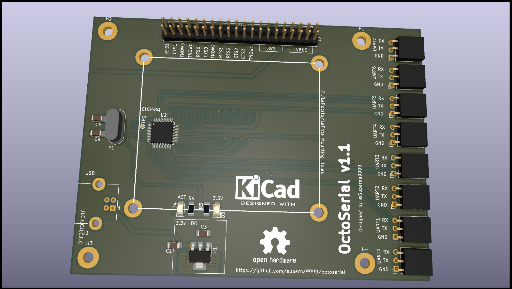

# OctoSerial

USB High-Speed to 8x RS-232 TTL level with the CH348Q IC.



Schematics: [octoserial.pdf](octoserial.pdf)

Changelog
---------

Version 1.1:
- Production version with 40pins headers with GPIOs + 3v3 + VBUS & GND

Version 0.1:
- Initial prototype with CH348Q samples


LICENCE
-------

```
Apache License Version 2.0
```
